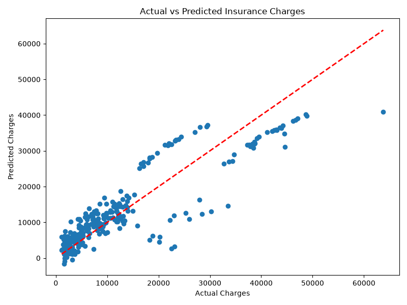

# Medical Insurance Cost Prediction using Multiple Linear Regression

## Objective

To develop a Multiple Linear Regression model that predicts medical insurance charges based on customer demographic and health-related attributes.

---

## Dataset

Medical Cost Personal Insurance Dataset

https://www.kaggle.com/datasets/mirichoi0218/insurance

---

## Libraries Used

- Python
- Pandas
- NumPy
- Matplotlib
- Seaborn
- Scikit-learn

---

## Methodology

1. Load the dataset.
2. Perform data exploration.
3. Check for missing values.
4. Encode categorical variables.
5. Split the dataset into training and testing sets.
6. Train a Multiple Linear Regression model.
7. Predict insurance charges.
8. Evaluate the model using MAE, MSE, and R² Score.
9. Create an Actual vs Predicted scatter plot for model        visualization.

---

## Results

- **Mean Absolute Error (MAE):** 4181.19
- **Mean Squared Error (MSE):** 33596915.85
- **R² Score:** 0.7836

---

## Observations

1. The model achieved an R² score of 0.7836, indicating that it explains approximately 78% of the variation in medical insurance charges.
2. The MAE of 4181.19 shows that the predicted insurance charges are reasonably close to the actual values on average.
3. The scatter plot indicates that most predictions follow the overall trend of the actual charges, although some higher insurance charges show larger prediction errors.

---

## Model Visualization

---

## Conclusion

The current project has successfully implemented Multiple Linear Regression for the prediction of medical insurance charges from different factors like age, sex, Body Mass Index, number of children, smoking, and the region of a person. To begin with, the dataset was preprocessed through feature encoding and splitting into train and test datasets before implementing a machine learning algorithm. The R² score obtained from the implementation of the model has been 0.7836, implying that the implemented model has good predictive power, which means that the model explains quite a bit of variance of the medical insurance charges. This has shown that smoking, age, and BMI affect medical insurance prices strongly. However, the limitation of this model is that it assumes linearity between variables.

---

## Author

Manav M George
Integrated M.Tech (Artificial Intelligence)
VIT Bhopal University